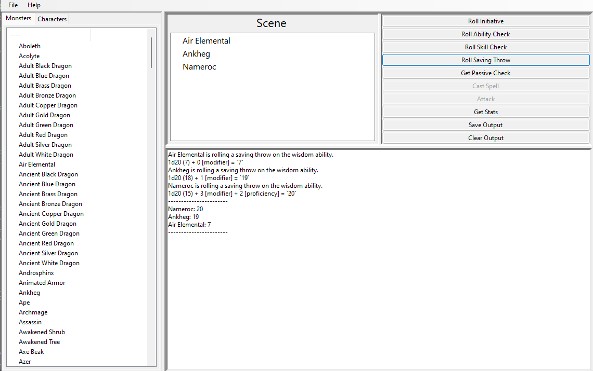

# TOGA

According to the [BeeWare website](https://beeware.org/), "Write once. Deploy everywhere.
Write your apps in Python and release them on iOS, Android, Windows, MacOS, Linux, Web, and tvOS using rich, native user interfaces. Multiple apps, one codebase, with a fully native user experience on every platform."

Having background in native Windows application programming, this has intrigued me to the point of making my own early software.

I started with understanding the documentation over at Beeware's [Toga](https://github.com/beeware/toga) library and managed to put together a very early implementation of a dnd game manager idea alongside the amazing library [dnd-character](https://github.com/tassaron/dnd-character) created by [tassaron](https://github.com/tassaron).

## Notes
- Toga is in its very early stages on the topic of Windows. There are some even basic ideologies that are not available. I'm hoping I can understand the library enough to contribute in the future.

